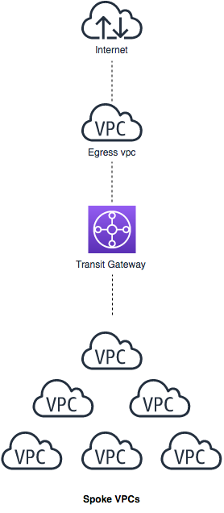
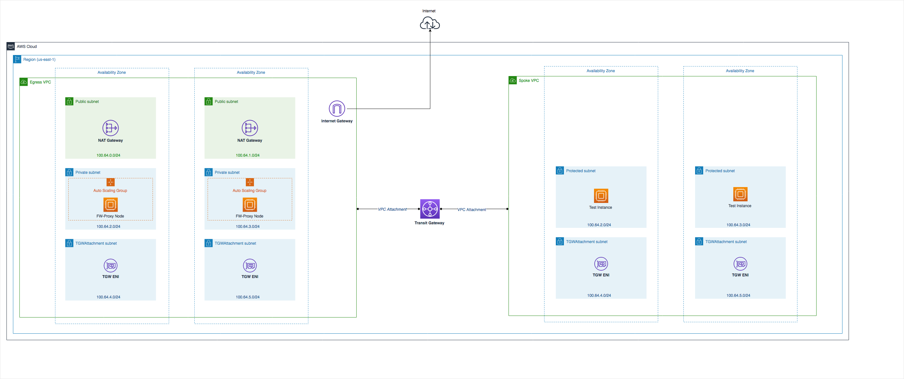
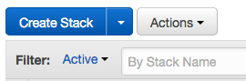
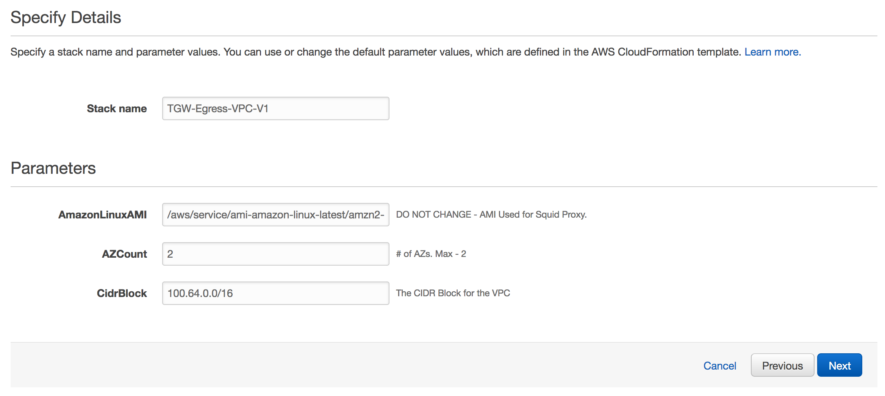
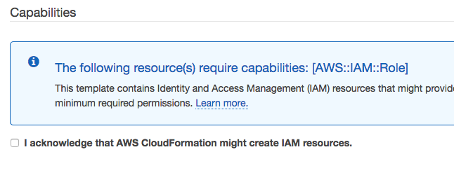
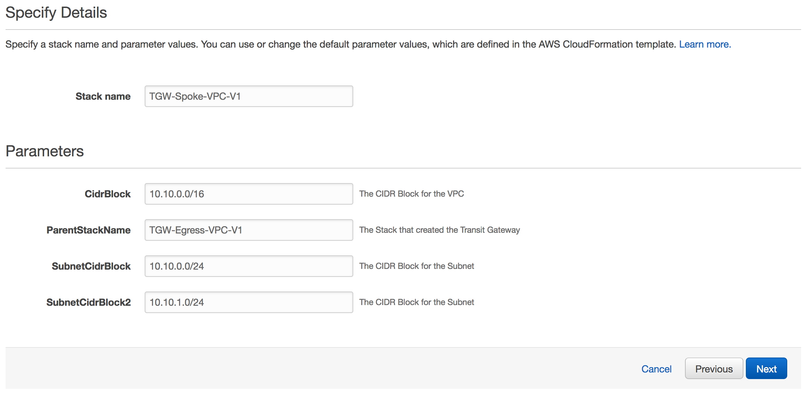
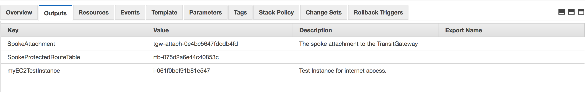
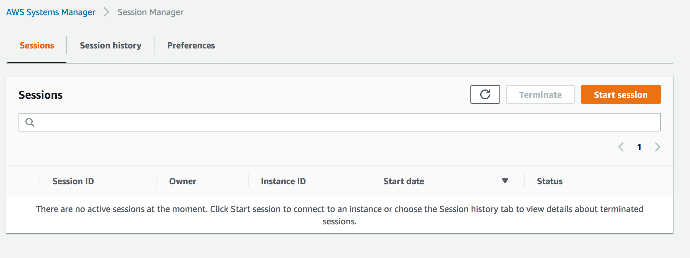
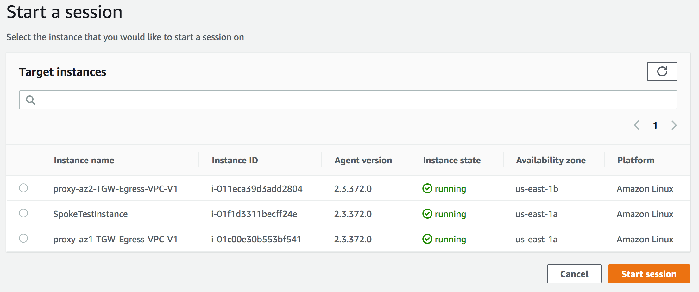
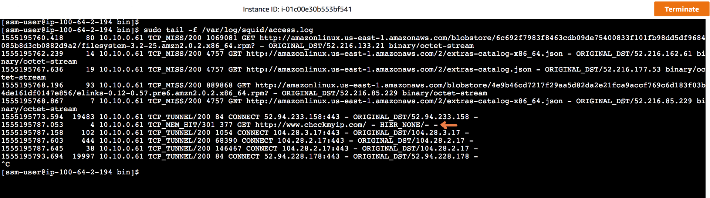

# AWS Transit Gateway Egress Vpc Demo
Author : Shakeel Ahmad | AWS Cloud Architect | Email : shkahma@amazon.com

## License:

This sample code is made available under the MIT-0 license. See the LICENSE file.

## Summary:

In this lab we will learn how to build and run a centralised NAT/Egress proxy solution using Transit Gateway. We'll start building with Egress VPC / Transit Gateway artifacts and in second phase, we'll build a Spoke VPC to test the reachability.

The diagram below illustrates the high level architecture the lab will be using. 

  

## Let's get started

- Clone the repo (Optional)

Following are the key Cloud Formation Templates we'll use in this lab:

| File name | Purpose | Quick Launch |
|-----------|---------|---------|
|[egress-vpc.yaml](https://github.com/aws-samples/aws-transit-gateway-egress-vpc-demo/raw/master/egress-vpc.yaml)| This template creates all necessary resources required for Egress VPC including TGW, Route Partitions, Route Tables, Attachments as well as squid based proxy servers in each AZ. | [](https://console.aws.amazon.com/cloudformation/home?region=us-east-1#/stacks/new?stackName=EgressVPC&templateURL=https://s3-ap-southeast-2.amazonaws.com/shkahma-devlabs2019/egress-vpc.yaml)|
|[spoke-vpc.yaml](https://github.com/aws-samples/aws-transit-gateway-egress-vpc-demo/raw/master/spoke-vpc.yaml)| This template will create a Spoke VPC in the same account and attachg it to TGW as well as update the route tables where necessary. | [](https://console.aws.amazon.com/cloudformation/home?region=us-east-1#/stacks/new?stackName=SpokeVPC&templateURL=https://s3-ap-southeast-2.amazonaws.com/shkahma-devlabs2019/spoke-vpc.yaml)|
Architecture:




### Step-1 : Create Egress VPC & TGW resources
**Command Line:**

Note: Ensure that the role you are assuming via CLI has appropriate permissions to perform below tasks.

```
aws cloudformation create-stack --template-url https://s3-ap-southeast-2.amazonaws.com/shkahma-devlabs2019/egress-vpc.yaml --stack-name TGW-Egress-VPC-V1 --capabilities CAPABILITY_IAM --region us-east-1
```

**Web Console:**

Go to Cloud Formation on the AWS Web console.

- Download the latest template (or clone the repo itself): https://github.com/aws-samples/aws-transit-gateway-egress-vpc-demo/raw/master/egress-vpc.yaml
- Switch to US East (N. Virginia)
- Click on "Create Stack"

  

- Choose "Upload a template to Amazon S3", select "egress-vpc.yaml" and press Next.
- For Stack Name, enter : TGW-Egress-VPC-V1 (or you can choose your own - but make a note of it).
- Leave rest of the parameters as it is. By default, we'll select latest Amazon Linux AMI, Deploy the solution in 2 AZs as well as use 100.64.0.0/16 as the CIDR block for Egress VPC.
  
  

- Click Next, accept all the defaults options and click Next to review screen.
- On Review page, select "I acknowledge that AWS CloudFormation might create IAM resources."

  

- Click Create to start the build.
- Wait for Step 1 to be completed. Once completed, start Step 2.

### Step-2 : Create Spoke VPC & Test resources

**Command Line:**
Note: Ensure that the role you are assuming via CLI has appropriate permissions to perform below tasks.

```
aws cloudformation create-stack --template-url https://s3-ap-southeast-2.amazonaws.com/shkahma-devlabs2019/spoke-vpc.yaml  --stack-name TGW-Spoke-VPC-V1 --parameters ParameterKey=ParentStackName,ParameterValue=TGW-Egress-VPC-V1 --capabilities CAPABILITY_IAM --region us-east-1
```

**Web Console:**

If not already - Go to Cloud Formation on the AWS Web console.

- Download the latest template (or clone the repo itself): https://github.com/aws-samples/aws-transit-gateway-egress-vpc-demo/raw/master/spoke-vpc.yaml
- Click on "Create Stack"

  

- Choose "Upload a template to Amazon S3", select "spoke-vpc.yaml" and press Next.
- For Stack Name, enter : TGW-Spoke-VPC-V1 (or you can choose your own).
- For "ParentStackName" : Enter "TGW-Egress-VPC-V1" or the choosen previously created egress VPC stack name in Step 1.
- Leave rest of the parameters as it is.

  

- Click Next, accept all the defaults options and click Next to review screen.
- On Review page, select "I acknowledge that AWS CloudFormation might create IAM resources."


- Click Create to start the build.
- Once the build is complete, click on "Outputs" window & note down "myEC2TestInstance" value. This is the test instance inside the VPC we'll use to test reachabaility.




### Step-3 : Test & Play ! 

Go to Systems Manager on the AWS Web console in the same region.

- Click on "Session Manager" under "Actions"
- Click on "Start Session"



- In "Start the session", choose the Target Instance (Name: SpokeTestInstance) as noted from the output of Step 2 & press Start Session.
- A terminal session would open in a new window.

- In Systems Manager Window, repeat the above process to launch terminal for Proxy Instance in the same AZ as Test Instance.



- Enter following command on proxy servers to monitor the squid logs:
  - sudo tail -f /var/log/squid/access.log

Verify Internet on Test Instance:

- In Terminal Session window for Test Instance, now you can test the internet reachability via following shell commands:
  - ping 1.1.1.1
  - links https://www.checkmyip.com
  - links https://www.whatismypublicip.com
  - links https://ip.zscaler.com
  - NOTE: The Public IP Address displayed would be the NAT-GW from Egress VPC.

- Switch back to proxy servers and confirm that the request to www.checkmyip.com is showing up in logs.



- Perform other connectivity tests if required.


### Step-4 : Clean up (Estimated Duration - 5 mins)


**Command Line:**

Note: Ensure that the role you are assuming via CLI has appropriate permissions to perform below tasks.


```
aws cloudformation delete-stack --stack-name TGW-Spoke-VPC-V1 --region us-east-1
aws cloudformation delete-stack --stack-name TGW-Egress-VPC-V1 --region us-east-1
```

**Web Console:**

Go to Cloud Formation on the AWS Web console.

- Select "TGW-Spoke-VPC-V1" and select "Delete Stack" from actions. Confirm the deletion by selecting Yes.
- Once Spoke VPC Stack is deleted, select "TGW-Egress-VPC-V1" stack and select "Delete Stack" from actions. Confirm the deletion by selecting Yes.
- Above steps should delete all resources created as part of this lab.


### Learn more about TGW:

- Introducing AWS Transit Gateway (NET331) https://www.youtube.com/watch?v=yQGxPEGt_-w
- AWS Transit Gateway & Transit VPCs, Ref Arch for Many VPCs (NET402), https://www.youtube.com/watch?v=ar6sLmJ45xs
- VPC Fundamentals and Connectivity Options (NET201) https://www.youtube.com/watch?v=jZAvKgqlrjY